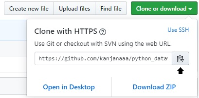
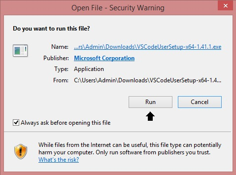

# python_dataviz
# นางสาวกาญจนา ประสาคุณ
# 603021855-2
# วิธีการติดตั้งโปรแกรม Miniconda 
## เข้าไปที่ลิงค์	https://docs.conda.io/en/latest/miniconda.html เพื่อทำการติดตั้ง โดยแนะนำให้ติดตั้ง เวอร์ชั่นใหม่ 3.7 

## ทำการ Run เพื่อติดตั้งโปรแกรม และ Install ลงเครื่อง

## เมื่อทำการติดตั้งเสร็จแล้วให้ search หา Anaconda Prompt (Miniconda3) จะขึ้นหน้าโปรแกรมตามตัวอย่าง

## พิมพ์คำสั่ง python  ลงในโปรแกรมเพื่อเช็คเวอร์ชั่น

## พิมพ์คำสั่ง  conda install matplotlib  เพื่อติดตั้ง

## พิมพ์คำสั่ง  conda install jupyter  เพื่อทำการติดตั้ง  jupyter ลงในโปรแกรม python

## ทำการสร้าง  Folder เพื่อเก็บงานที่จะบันทึกไว้ 

## พิมพ์คำสั่ง cd ตามด้วยที่อยู่ไฟล์ที่สร้างไว้หรือต้องการนำเข้าไปใน jupyter
### ตัวอย่าง cd “C:\Users\Admin\Documents\kanjna”
## จากนั้นพิมพ์คำสั่ง  jupyter notebook  เพื่อทำการเรียกใช้งาน jupyter 

## จะขึ้นหน้าโปรแกรมตามตัวอย่าง

## การเข้าใช้งาน jupyter ดังตัวอย่างในภาพ

## ลองใช้งานโดย พิมพ์คำสั่ง print(‘kanjana’)  กดที่ shift พร้อมกับ Enter เพื่อทำการรัน code

# การเข้าใช้งาน colab 
## เข้าไปที่ลิงค์ https://colab.research.google.com/notebooks/welcome.ipynb#recent=true

### *** เป็นโปรแกรมที่สามารถเข้าใช้งานได้ทุกที่ และแนะนำให้ใช้ใน Google Chrome
## ก่อนเข้าใช้งานให้ทำการ เชื่อม colab  กับ e-mail ก่อน เพื่อเก็บไฟล์งาน และทำการเข้าใช้งานที่ NEW PYTHON 3 NOTEBOOK

## จะขึ้นหน้าโปรแกรมตามตัวอย่าง

## พิมพ์คำสั่ง import pandas 
## ลองใช้งานโดย พิมพ์คำสั่ง print(‘kanjana’)  กดที่ shift พร้อมกับ Enter เพื่อทำการรัน code

### *** วิธีดาวน์โหลดไฟล์ลงเครื่อง

# การเข้าใช้งาน  GitHub
## เข้าไปที่ลิงค์	https://github.com/

## ทำการสมัคร account

## เมื่อทำการสมัคร account เสร็จ เข้าไปที่เมล์ที่ใช้ในการสมัคร จะได้หน้าดังตัวอย่าง

## เปิดโปรแกรม python  
## พิมพ์คำสั่ง  conda install –c anaconda git	เพื่อติดตั้ง git ลงในเครื่อง

## พิมพ์คำสั่ง  git clone ตามด้วยที่อยู่ลิงค์ GitHub เพื่อทำการเชื่อม GitHub กับ python 

 ### *** ที่อยู่ลิงค์ใน GitHub
 
 ## พิมพ์คำสั่ง cd python_dataviz
 
 ## พิมพ์คำสั่ง  dir เพื่อดูไฟล์ที่มีใน Folder

## พิมพ์คำสั่ง  git status เพื่อเช็คว่ามีไฟล์ไหนที่ยังไม่ซิงค์กับ GitHub

## พิมพ์คำสั่ง  git add ตามด้วยชื่อไฟล์ที่ต้องการนำเข้า

## พิมพ์คำสั่ง  git commit –m “----------” เพื่ออธิบายไฟล์ที่นำเข้า

## พิมพ์คำสั่ง  git push เพื่อให้ไฟล์ลิงค์เข้าไปใน GitHub 

### *** ตัวอย่างไฟล์ที่เข้าไปใน GitHub 

# วิธีติดตั้ง  code.visualstudio
## เข้าไปที่ลิงค์  https://code.visualstudio.com/ เพื่อทำการติดตั้ง

## ทำการ Run เพื่อติดตั้งโปรแกรม และ Install ลงเครื่อง

## พิมพ์คำสั่ง  code . เมื่อต้องการเรียกใช้โปรแกรมผ่าน python
 

